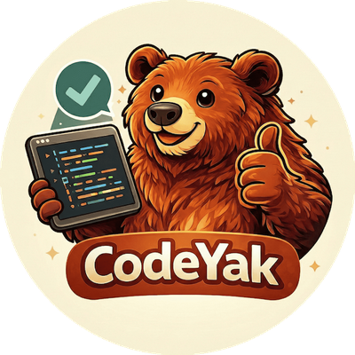

# CodeYak 🐻 - Guard your codebase

<p align="center">
  
</p>


**Built Strong:**
- 🎯 **Territorial guidelines system** - Defend your code standards with built-in presets (security, style, balanced)
- 🔍 **Multi-pass hunting** - Thorough, focused reviews that don't miss a thing
- 🧠 **Smart deduplication** - Never repeats itself

**Current Territory:** GitLab + Azure OpenAI (Expanding to GitHub, OpenAI, Anthropic)

## Quick Start

1. Configure CI/CD variables in GitLab (Settings → CI/CD → Variables):
   - `GITLAB_TOKEN`, `AZURE_OPENAI_API_KEY`, `AZURE_OPENAI_ENDPOINT`, `AZURE_DEPLOYMENT_NAME`, `AGENT_REPO_URL`

2. Add to `.gitlab-ci.yml`:
   ```yaml
   codeyak:
     stage: review
     image: python:3.12-slim
     before_script:
       - apt-get update && apt-get install -y git && pip install uv
     script:
       - git clone $AGENT_REPO_URL agent_code && cd agent_code
       - uv sync --frozen
       - uv run python -m codeyak $CI_MERGE_REQUEST_IID $CI_PROJECT_ID
     rules:
       - if: $CI_PIPELINE_SOURCE == 'merge_request_event'
   ```

3. **Watch it work** - Open a merge request and CodeYak automatically hunts for issues

## Guidelines System

Command CodeYak's behavior with YAML guideline files. The bear follows:
- **Your project guidelines** (`.codeyak/*.yaml`) when marking territory
- **Built-in `default` preset** when roaming free

Each YAML file triggers a separate focused hunting pass.

### Battle-Tested Presets

**`default`** - Full-strength protection (32 guidelines)
- Combines: `security` + `readability` + `maintainability`
- Comprehensive coverage of code quality

**`security`** - Fortress mode (15 guidelines)
- Secrets management, injection prevention (SQL, XSS, command)
- Authentication, authorization, session management
- Strong cryptography, password hashing
- Data encryption, safe error handling

**`readability`** - Crystal clear code (7 guidelines)
- Function length and clarity
- Descriptive and intentional naming
- Self-documenting code, meaningful comments

**`maintainability`** - Built to last (10 guidelines)
- Single Responsibility, low complexity
- Logical organization, code proximity
- DRY principle, no dead code
- Proper exception handling

### Custom Guidelines

Train CodeYak with your own rules in `.codeyak/my-rules.yaml`:

```yaml
guidelines:
  - label: rate-limiting
    description: All API endpoints must include rate limiting.

  - label: n-plus-one
    description: Avoid N+1 queries by using eager loading.
```

Guidelines are automatically tagged based on filename and label:
- File: `my-rules.yaml` → Prefix: `my-rules`
- Label: `rate-limiting` → ID: `my-rules/rate-limiting`

**ID format:** `prefix/label` (e.g., `security/sql-injection`, `custom/rate-limiting`)
**Label requirements:** lowercase, alphanumeric, hyphens only

### Combining Forces

Stack built-in presets with your custom rules:

```yaml
includes:
  - builtin:security
  - builtin:readability

guidelines:
  - label: api-timeout
    description: All external API calls must have timeout limits.
```

**Available reinforcements:** `builtin:default`, `builtin:security`, `builtin:readability`, `builtin:maintainability`

### Multi-Pass Reviews

```
.codeyak/
├── 01-security.yaml      # Security sweep
├── 02-style.yaml         # Style enforcement
└── 03-project-rules.yaml # Your custom rules
```

Each file can include built-in presets or define custom guidelines. CodeYak never misses.

## Environment Variables

**Required:**
```bash
GITLAB_URL=https://gitlab.com
GITLAB_TOKEN=<your-token>
AZURE_OPENAI_API_KEY=<your-key>
AZURE_OPENAI_ENDPOINT=<your-endpoint>
AZURE_OPENAI_API_VERSION=2024-02-15-preview
AZURE_DEPLOYMENT_NAME=gpt-4o
```

**Optional:**
```bash
LANGFUSE_SECRET_KEY=<key>    # For observability
LANGFUSE_PUBLIC_KEY=<key>
LANGFUSE_HOST=https://cloud.langfuse.com
```

## Local Development

```bash
# Get the bear
git clone <repo-url> && cd codeyak
cp .env.example .env  # Fill in credentials
uv sync

# Release it on a merge request
uv run python -m codeyak <MR_IID> <PROJECT_ID>

# Test with custom guidelines
mkdir -p .codeyak
echo "includes:
  - builtin:security" > .codeyak/security.yaml
uv run python -m codeyak <MR_IID> <PROJECT_ID>
```

## How It Works

1. Fetches MR diff and existing review comments
2. Runs review pass(es) based on active guidelines
4. Posts only new, unique findings as inline comments

---

**Built with fierce determination** 🐻 **using Python and AI**
